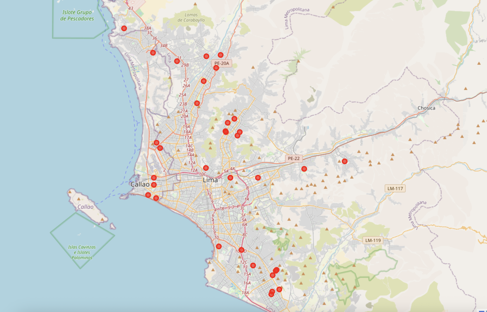

# Crime Data - Peru

This project contains data for crimes registered in Peru. 


`cd /path/to/repo`

```
python3 -m http.server 8000
```

then open `http://localhost:8000/map.html` in your favorite browser

